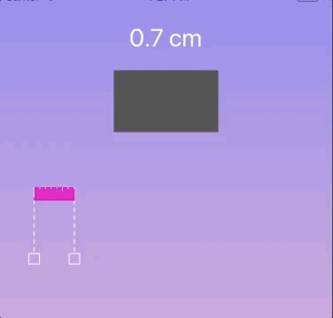

# RulerControl

`RulerControl` is a draggable, resizable `UIControl` that provides real world length measurement. It supports various units of length, but is most appropriate for measurements in centimeters or inches.



## How to use

### Measurement in real world units
Set up `plane` with device ppi:

```swift
let device = Device() // Open source DeviceKit provides ppi
if let ppi = device.pointsPerInch {
    let plane = Plane(pointsPerUnit: ppi, unit: .inch)
    rulerControl.plane = plane
    rulerControl.baseUnit = .centimeter
}
rulerControl.addTarget(self, action: #selector(rulerChanged), for: .valueChanged)
rulerControl.isContinuous = true
```

### Measurement in relative units
Use just like a slider:

```swift
rulerControl.addTarget(self, action: #selector(rulerChanged), for: .valueChanged)
```
### Customizable appearance and behavior
```swift
struct Defaults {
    static let thickness: CGFloat = 15.0
    static let color = UIColor.blue
    static let handleColor = UIColor.blue
    static let baseUnit: DistanceUnit = .centimeter
    static let hashMarkColor = UIColor.white
    static let handleSize = CGSize(width: 40.0, height: 120.0)
    static let handleLineWidth: CGFloat = 14.0
    static let minimumLineLength: CGFloat = 30.0 // Line segment never gets shorter than this
    static let isContinuous = false
    static let showActual = true
}
```
